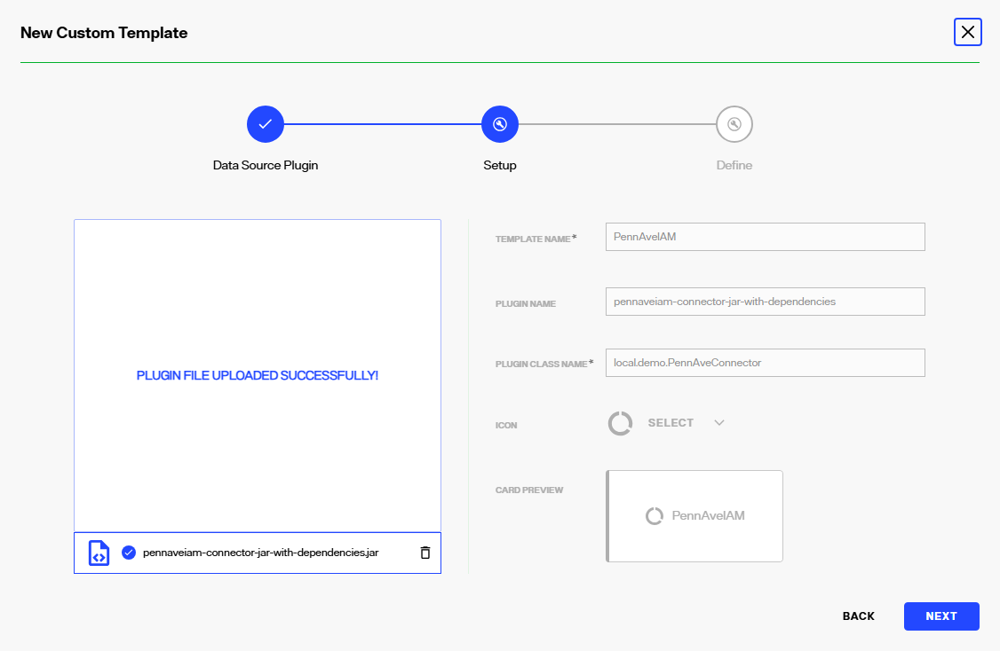
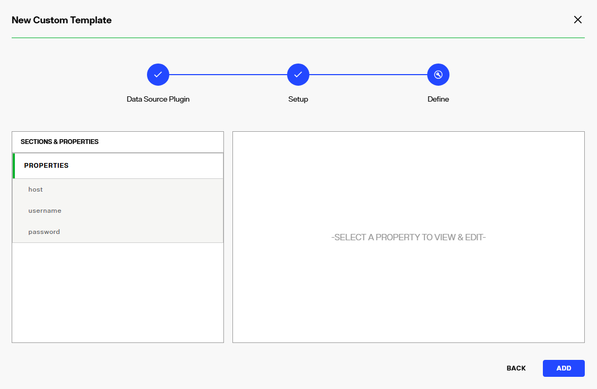
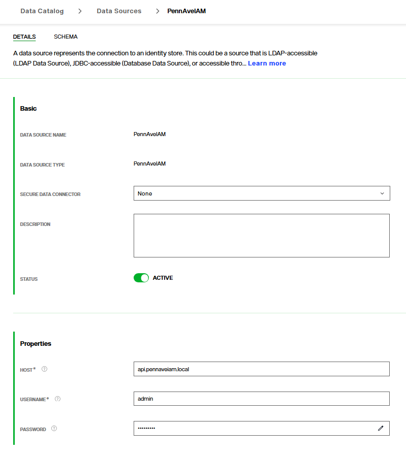

# Getting Started Tutorial

This tutorial and sample project are provided to demonstrate the steps involved in building a real connector. The tutorial should be followed end-to-end, but it can also serve as a quick reference when building a new connector.

For the tutorial, we will build a connector to an imaginary _PennAveIAM_ server that provides account services for American presidents. The connector will need to support LDAP search operations and use the provided `PennAveClient` for accessing the server's REST API. Each section ends with a valid connector that's usable by IDDM.

Get started by cloning this sample project and loading it as a Maven project in your IDE.

The project follows the [Maven Standard Directory Layout](https://maven.apache.org/guides/introduction/introduction-to-the-standard-directory-layout.html) and includes a few of files to get started:

```text
└───sdk-tutorial
    ├───pom.xml
    ├───README.md
    ├───screenshots
    ├───PennAveIAMDatasource.zip
    └───src
        ├───main
        │   ├───java
        |   |   └───local.demo
        |   |       └───PennAveClient.java
        │   └───resources
        |       ├───local.demo
        |       |    └───pennave_connector.json
        |       └───sample_data.json  
        └───test
            └───java
```

### Create a connector

----------------------------------------------------

Start by creating a new class called `PennAveConnector`:

```java
@CustomConnector(configuration = "pennave_connector.json")
public class PennAveConnector implements Connector {
  /* ...does nothing... */
}
```

There are two things to notice. First, `PennAveConnector` implements the `Connector` interface. This tells IDDM that `PennAveConnector` class is a connector. Second, the `@CustomConnector` annotation is added as a way to provide IDDM additional information about the connector and how to use it. (More on that later.)

It isn't much but this is a valid connector. It can be packaged into a JAR using Maven then used to create a custom datasource in IDDM. But because the connector doesn't yet support any operations, IDDM would return an LDAP error for all incoming requests.


### Support LDAP search

----------------------------------------------------

The first step to making the connector useful is updating it to support LDAP search. We do this by replacing the `Connector` interface with `ReadOperations<SearchRequest, LdapResponse<String>>` in the class definition:

```java
@CustomConnector(configuration = "pennave_connector.json")
public class PennAveConnector
    implements SearchOperations<LdapSearchRequest, LdapResponse<String>> {

  @Override
  public LdapResponse<String> search(LdapSearchRequest searchRequest) {
    // TODO: Return something to IDDM when a search is performed 
  }
}
```

Implementing `SearchOperations<LdapSearchRequest, LdapResponse<String>>` tells IDDM a few things about the connector:

1. It is a connector because it implements `SearchOperations` which extends `Connector`
2. It supports LDAP search because it implements `SearchOperations`
3. It expects to receive search requests from IDDM as `LdapSearchRequest` objects
4. It will return search results to IDDM as `LdapResponse<String>` objects

Adding `SearchOperations` requires the connector implement `search()`. This method will be called by IDDM whenever a search request is received. We're not yet ready to actually search for anything, so we'll return an error indicating the search operation is unavailable:

```java
@Override
public LdapResponse<String> search(LdapSearchRequest searchRequest) {
  return new LdapResponse<>(LdapResultCode.UNAVAILABLE);
}
```

The updated connector can now receive LDAP search requests from IDDM.

### Connect to the external service

----------------------------------------------------

A useful connector needs to actually connect to something, so let's update the connector to use the PennAveIAM REST service.

The `PennAveClient` class requires a hostname, username, and password to connect.  But these values aren't known until runtime, well after the connector is written and deployed, so the connector will use the `@Property` annotation to request the information from IDDM. 

Update `PennAveConnector` by adding the constructor:

```java
@CustomConnector(configuration = "pennave_connector.json")
public class PennAveConnector
    implements SearchOperations<LdapSearchRequest, LdapResponse<String>> {
  
  // Single constructor that uses @Property annotation to request properties from IDDM
  public PennAveConnector(
      @Property(name = CUSTOM_DATASOURCE_PROPERTIES) ReadOnlyProperties connectionProperties) {
      // TODO: Use the property values provided by IDDM to create a PennAveClient
  }
}
```

Adding the `@Property` annotated constructor parameter tells IDDM to inject the `CUSTOM_DATASOURCE_PROPERTIES` property set when creating the constructor. This property set contains all the information needed to create the `PennAveClient` then open a connection: 

```java
@CustomConnector(configuration = "pennave_connector.json")
public class PennAveConnector
    implements SearchOperations<LdapSearchRequest, LdapResponse<String>> {

  // Member variable reference to the PennAveClient created in the constructor
  private final PennAveClient pennAveClient;

  public PennAveConnector(
      @Property(name = CUSTOM_DATASOURCE_PROPERTIES) ReadOnlyProperties connectionProperties) {

    // Read individual properties provided by IDDM 
    String host = (String) connectionProperties.get("host");
    String username = (String) connectionProperties.get("username");
    String password = (String) connectionProperties.get("password");

    // Create an instance of the REST client and connect
    this.pennAveClient = new PennAveClient(host, username, password);
    this.pennAveClient.connect();
  }
}
```

It's reasonable to wonder where the individual properties come from: they're all defined in the `pennave_connector.json`. But more on that later.

The connector now has everything it needs to connect to and query the PennAveIAM server.

### Returning data

----------------------------------------------------

It's time to return some actual search results.

To start, the connector will return all users whenever it receives any search request. It'll do this by calling `PennAveClient.getAllUsers()`. This method gets all the users from the PennAveIAM server and returns the data as a raw JSON string (or `null` if the request fails):

```json 
[
  {
    "username": "washington",
    "firstName": "George",
    "lastName": "Washington",
    "email": "washington@executive.gov",
    "politicalParty": "Federalist",
    "termsServed": 2
  },
  ...
]
```

Update the `PennAveConnector.search()` method to get the user data then include it in the `LdapResponse`:

```java
@Override
public LdapResponse<String> search(LdapSearchRequest searchRequest) {

  // Get user data from the PennAveIAM server
  String jsonResponse = pennAveClient.getAllUsers();
  
  // Return a successful response only if there are search results
  return jsonResponse != null ?
    // Include the data in the response to IDDM
    new LdapResponse<>(LdapResultCode.SUCCESS, jsonResponse) :
    new LdapResponse<>(LdapResultCode.OPERATIONS_ERROR);
}

```

Notice the JSON string is placed directly in the `LdapResponse` without any additional processing. This works because IDDM automatically converts the connector response into an LDAP appropriate format. The only requirement is for the connector to return data that is serializable to JSON. (The connector does not need to actually perform any serialization. IDDM does the work.)

The connector now returns real data to IDDM.

### Refine the search process

----------------------------------------------------

The connector began supporting search operations as soon as it implemented the `SearchOperations` interface. But so far, it has completely ignored the actual request and returned only generic responses. Let's change that. If the connector receives a base scope search, then it should return only the user identified in the request's base DN. In all other cases, the connector should return all users.

Implementing this behavior requires inspecting the `LdapSearchRequest` argument. Start by adding a `getUsername()` method to `PennAveConnector` for extracting the username from the base DN:

```java
private String getUsername(LdapSearchRequest searchRequest) {
  
  // Get the base DN from the search request. Ex: "username=washington,o=pennaveiam"
  DN dn = searchRequest.getBaseDN();
  
  // Split the DN into its individual components. Ex: ["username=washington", "o=pennaveiam"]
  List<RDN> components = dn.getRDNs();
  
  // Retrieve the left-most RDN. Ex: "username=washington"
  RDN rdn = components.get(0);
  
  // Retrieve username. Ex: "washington"
  return rdn.getAttributeValue();
}
```

Next, update `PennAveConnector.search()` to take a different action based on the search scope:

```java
@Override
public LdapResponse<String> search(LdapSearchRequest searchRequest) {
  
    String jsonResponse = null;
    if (searchRequest.getSearchScope() == SearchScope.BASE) {
      // Extract the username from the incoming search request
      String username = getUsername(searchRequest);
      // Search the PennAveIAM server for the specific user  
      jsonResponse = pennAveClient.getUser(username);
    } else {
      jsonResponse = pennAveClient.getAllUsers();
    }

    return jsonResponse != null ?
        new LdapResponse<>(LdapResultCode.SUCCESS, jsonResponse) :
        new LdapResponse<>(LdapResultCode.OPERATIONS_ERROR);
}
```

The connector now supports getting all users and specific users.

### Describe the connector

----------------------------------------------------

The connector configuration is a JSON file that both provides details to IDDM about how the connector should be displayed and defines custom properties for the connector. We would normally need to write this file from scratch, but in this tutorial, a ready-to-use file (_pennave_connector.json_) is provided for us. Let's open it to review a few important points.

First, the `name` and `description` values are used by IDDM when displaying the connector in the IDDM Control Panel:   

```json
{
  "name": "PennAveIAM",
  "description": "PennAveIAM custom connector used for the Getting Started tutorial",
  ...
```

Next, the `meta` section is a JSON array for defining custom properties that IDDM users must provide when using the connector. These will often be properties for connecting to a remote data source, as in our `PennAveIAM` connector, but we are free to define whatever properties we would like. 

```json
{
  ...
  "meta": [
    {
      "name": "host",
      "description": "Host name of the PennAveIAM server",
      "sectionName": "Properties",
      "defaultValue": "api.pennaveiam.local",
      "dataType": "STRING",
      "isRequired": true,
      "regex": null
    },
    {
      "name": "username",
      "description": "Username for authenticating to the PennAveIAM server",
      "sectionName": "Properties",
      "defaultValue": "admin",
      "dataType": "STRING",
      "isRequired": true,
      "regex": null
    },
    {
      "name": "password",
      "description": "Password for authenticating to the PennAveIAM server",
      "sectionName": "Properties",
      "defaultValue": "Password1",
      "dataType": "PASSWORD",
      "isRequired": true,
      "regex": null
    }
  ]
}

```

The connector now includes information to help users identify and configure it in the IDDM Control Panel.

### Package the connector

----------------------------------------------------

Now that the connector is fully implemented, we can package it for IDDM to use. This requires creating a JAR that includes the connector code and external dependencies (such as Apache Commons libraries) because IDDM does not provide dependency management. We can do this by executing the Maven goals `clean` and `package` from either the IDE or terminal:

```text
$ mvn clean package
```

This will produce two JARs in the project's `target` directory: _pennaveiam-connector.jar_ and _pennaveiam-connector-jar-with-dependencies.jar_. The _pennaveiam-connector-jar-with-dependencies.jar_ is the one we want. This is the JAR that will be deployed to IDDM.

### Deploy to IDDM

----------------------------------------------------

With _pennave-connector-jar-with-dependencies.jar_ built and ready to use, follow the [IDDM documentation for creating a new template](https://developer.radiantlogic.com/idm/v8.1/configuration/data-sources/data-sources/#creating-templates). This will walk you through loading the connector into IDDM. However, one notable difference is there will be no need to fill-in details about the connector because IDDM automatically reads this information from the configuration file. If everything works correctly, you should see details about the connector automatically populated:





Once the JAR is loaded and a new template created, the connector is available to use in IDDM. To try it out, import the _PennAveIAMDatasource.zip_ datasource provided in this tutorial by following the [IDDM documentation for importing data sources](https://developer.radiantlogic.com/idm/v8.1/configuration/data-sources/data-sources/#importing-data-sources). If the import is successful, a new configured data source called _PennAveIAM_ will appear in the Control Panel:

 

Finally, create a naming context and browse the data.

### Completed Sample Connector

----------------------------------------------------

Below is the completed `PennAveConnector.java` code built in this tutorial. 

```java
package local.demo;

import static com.radiantlogic.iddm.base.InjectableProperties.CUSTOM_DATASOURCE_PROPERTIES;

import com.radiantlogic.iddm.annotations.CustomConnector;
import com.radiantlogic.iddm.annotations.Property;
import com.radiantlogic.iddm.base.ReadOnlyProperties;
import com.radiantlogic.iddm.base.SearchOperations;
import com.radiantlogic.iddm.base.SearchScope;
import com.radiantlogic.iddm.ldap.DN;
import com.radiantlogic.iddm.ldap.LdapResponse;
import com.radiantlogic.iddm.ldap.LdapResultCode;
import com.radiantlogic.iddm.ldap.LdapSearchRequest;
import com.radiantlogic.iddm.ldap.RDN;
import java.util.List;

@CustomConnector(configuration = "pennave_connector.json")
public class PennAveConnector implements
    SearchOperations<LdapSearchRequest, LdapResponse<String>> {

  // Member variable reference to the PennAveClient created in the constructor
  private final PennAveClient pennAveClient;

  public PennAveConnector(
      @Property(name = CUSTOM_DATASOURCE_PROPERTIES) ReadOnlyProperties connectionProperties) {

    // Read individual connection properties provided by IDDM
    String host = (String) connectionProperties.get("host");
    String username = (String) connectionProperties.get("username");
    String password = (String) connectionProperties.get("password");

    // Create an instance of the REST client and connect
    this.pennAveClient = new PennAveClient(host, username, password);
    this.pennAveClient.connect();
  }

  @Override
  public LdapResponse<String> search(LdapSearchRequest searchRequest) {

    String jsonResponse = null;
    if (searchRequest.getSearchScope() == SearchScope.BASE) {
      // Extract the username from the incoming search request
      String username = getUsername(searchRequest);
      // Search the PennAveIAM server for the specific user
      jsonResponse = pennAveClient.getUser(username);
    } else {
      jsonResponse = pennAveClient.getAllUsers();
    }

    return jsonResponse != null ?
        new LdapResponse<>(LdapResultCode.SUCCESS, jsonResponse) :
        new LdapResponse<>(LdapResultCode.OPERATIONS_ERROR);
  }

  private String getUsername(LdapSearchRequest searchRequest) {
    // Get the base DN from the search request. Ex: "username=washington,o=pennaveiam"
    DN dn = searchRequest.getBaseDN();
    // Split the DN into its individual components. Ex: ["username=washington", "o=pennaveiam"]
    List<RDN> components = dn.getRDNs();
    // Retrieve the left-most RDN. Ex: "username=washington"
    RDN rdn = components.get(0);
    // Retrieve username. Ex: "washington"
    return rdn.getAttributes().get(0).getValues().get(0);
  }
}
```
